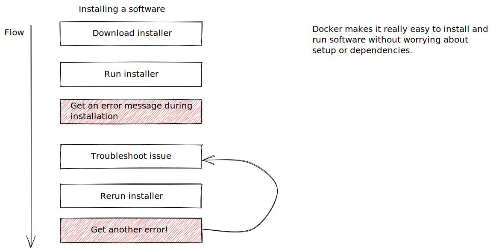
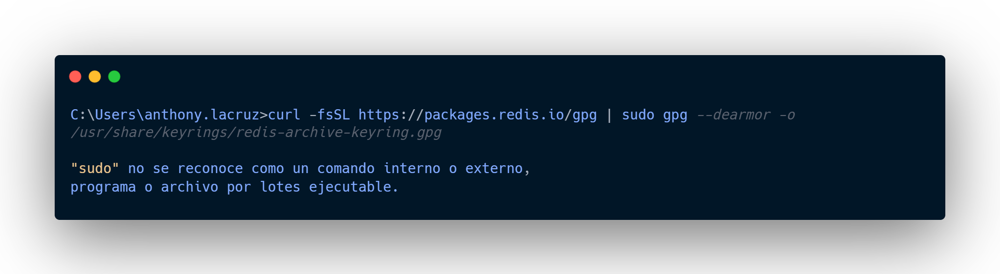
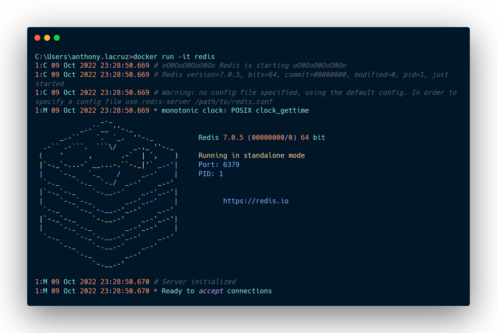

# Why use docker?

We're going to first tackle why we use Docker by going through a quick little flow diagram.

*
1. Installing a software flow
*

And this is a flow of probably a process you've gone through at least once in your life before. It's a flow of installing software on your personal computer.

What is the issue with this flow? 

If we try to install [Redis](https://redis.io/docs/getting-started/installation/install-redis-on-windows/#:~:text=guide%20assumes%20Ubuntu.-,Install%20Redis,-Once%20you%27re%20running), which is an in-memory data store without taking in consideration whole dependencies we will get the next error:

*
2. Dependencies error
*

And I bet at least once for you this is what has happened.

Maybe you have downloaded some installer, you run that installer, and then inevitably at some point in time you end up getting an error message during installation.

So what do you do?

- Well, you probably troubleshoot the issue by looking on Google.

- You try to find a solution.

- You eventually solve that issue.

- You then rerun the installer only to find, hey, now you have some other error appearing and then

- You have to go through this entire troubleshooting process again.

So this is at its core what Docker is trying to fix.

Docker wants to make it really easy and really straightforward for you to install and run software on any given computer, not just your computer, not just your personal laptop or your personal desktop,

But on web servers as well or any cloud based computing platform.

So let me now show you how easy it is to run Redis if we use Docker.

I'll use [Docker](https://docs.docker.com/engine/install/#:~:text=Docker%20Desktop%20for%20Windows) on command line: `docker run -it redis`

And then after a very brief pause, almost instantaneously, I have an instance of Redis up and running on my computer, and that's pretty much it.

*
3. Running an instances Redis with Docker command
*

That is Docker in a nutshell.

That is how easy it is to run software when you're making use of Docker.

So to answer the question very directly of why we use Docker, well, we make use of it because it makes life really easy for installing and running software without having to go through a whole bunch of setup or installation of dependencies.